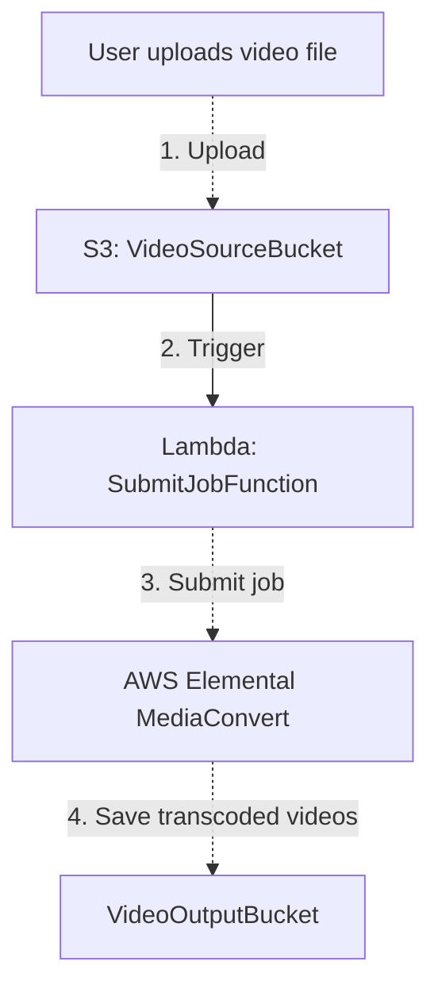

# Serverless Video Conversion using AWS Elemental MediaConvert

AWS Lambda (Python) function triggered when a new video is uploaded to S3. The Lambda function then submits a job to AWS Elemental MediaConvert

This application is useful for scenarios such as:
- User-generated content platforms where users upload videos that need to be transcoded for streaming
- Automated video processing pipelines for media companies
- Any serverless architecture requiring video transcoding capabilities without managing servers

> For use with template-pipeline.yml which can be deployed using [Atlantis Configuration Repository for Serverless Deployments using AWS SAM](https://github.com/63Klabs/atlantis-cfn-configuration-repo-for-serverless-deployments). The application template was adapted from [Starter 01 - Basic API Gateway and Lambda using Python](https://github.com/63Klabs/atlantis-starter-00-basic-apigw-lambda-nodejs)

> NOTE! While this is serverless, meaning you only get charged for what you use, not for any idle time, you ARE charged for what you use. My personal experience in converting a 30 min video and 10 3 min videos (approx 60 min total) from 4K to 4K Optimized, 1080, 720, and SD and Stream chunks in `us-east-2` has cost about USD$100.

So, while free to set up, and you don't get charge for having it sit there, there is a cost if you USE it. If you are just experimenting I suggest having a 30 second to 1 minute video ready for testing and only upload large videos when you are in production and serious about hosting video content.

## Demo

This application stack is used in conjunction with S3 fronted by CloudFront and a React-based site hosted on AWS Amplify on my personal hobby site [Doghouse Lights](https://doghouselights.com) under the Videos section. This application processes the videos I upload to then be streamed in various formats and sizes depending on device or network connection.

## Work Flow

1. User (or process) uploads a video file to S3 bucket (`VideoSourceBucket`)
2. S3 triggers Lambda function (`SubmitJobFunction`)
3. Lambda function submits a job to AWS Elemental MediaConvert to transcode the video into
   multiple formats and resolutions. The job contains information on where to put the output and the IAM Role to use.
4. Transcoded videos are saved to another S3 bucket (`VideoOutputBucket`)



To maintain a micro-service, this stack ONLY manages processing of the video. It is part of a process chain.

You will still need a mechanism to upload to the `VideoSourceBucket` (CLI or web based site) and an `VideoOutputBucket` that can be fronted by CloudFront. (Additional templates are provided by 63Klabs to maintain the S3 fronted by CloudFront stacks)

## Usage

This uses the [63Klabs Atlantis framework](https://github.com/63Klabs/atlantis-cfn-configuration-repo-for-serverless-deployments) to manage the pipeline and storage stacks.

This is one part of a multi-stack deployment. Think of it as part of a chain of events. It could even be extended into a step function that not only sends jobs to [MediaConvert](https://aws.amazon.com/mediaconvert/), but also [Amazon Rekognition](https://aws.amazon.com/rekognition/) and [Amazon Transcribe](https://aws.amazon.com/transcribe/).

MediaConvert could also be removed from this stack and replaced with an image resizing/watermarking function. The event-driven nature of S3 could be retained.

### Uploads

The video object can be placed in the VideoSourceBucket from the cli:

```bash
aws s3 cp large-video-file.mp4 s3://<VideoSourceBucket>/
```

Or using a separate process such as an online video upload mechanism or other automated process.

### Output

You will need an output bucket (and S3 object prefix) that you will pass to the stack as `VideoOutputBucket` and `VideoOutputPrefix` parameters respectively. This can either be a bucket for public consumption via CloudFront, or a drop bucket that is then picked up by the next process.

The output bucket must be configured to allow AWS Elemental MediaConvert to write to it. See [AWS Documentation](https://docs.aws.amazon.com/mediaconvert/latest/ug/setting-up-s3-buckets.html) for details.

## Deployment

This stack is designed to be deployed using the [63Klabs Atlantis framework](https://github.com/63Klabs/atlantis-cfn-configuration-repo-for-serverless-deployments). 

Like any other project, you can skip the framework and go at it on your own by modifying the code and templates to fit your needs. However, if you are managing many projects manually (especially on your own or part of a small team), the Atlantis framework is highly recommended as it implements Platform Engineering and AWS best practices. Plus it utilizes AWS native resources including SAM deployments and CloudFormation without the need of proprietary DevOps tools. Everything is API, CloudFormation template, and SAM CLI based. There are a lot of logging, metrics, and security features already baked into the templates so you don't need to start from scratch.

### Deployment Using 63Klabs Atlantis

Deploy using the Atlantis CLI scripts from your DevOps SAM Config repo:

```bash
# Create the storage stack that will serve as the VideoOutputBucket
./cli/config.py storage PREFIX MY_STATIC_ASSETS
# choose the template-storage-s3-cloudfront.yml template when asked
# You will need the bucket name and prefix (object path) when setting up the application later

# Create the repo and seed it from the @chadkluck/serverless-video-converter
./cli/create_repo.py YOUR_GITHUB/YOUR_REPO_NAME --provider github --source https://github.com/chadkluck/serverless-video-converter

# OR, if using CodeCommit:
./cli/create_repo.py YOUR_REPO_NAME --provider codecommit --source https://github.com/chadkluck/serverless-video-converter

# Clone the repository and perform your first deployment AS-IS just to make sure it works
cd .. # Be sure to do this OUTSIDE of the DevOps SAM Config repo! Either from same command line or in a separate window
git clone YOUR_REPO_URL
cd YOUR_REPO_NAME

# checkout dev
git checkout dev
# inspect ./application-infrastructure/template-configuration.json and ensure the VideoOutputPrefix matches the output bucket prefix (Leave VideoOutputBucket as that will be brought in from the pipeline)
# If you make any changes, ensure you commit and push the changes back to dev (however, try to deploy as-is to make troubleshooting easier)

# You must merge dev into test before creating the pipeline (so it has something to deploy)
git checkout test
git merge dev
git push

# Create the test environment and deploy
# Go back to your DevOps SAM Config repo
cd ../YOUR_DEVOPS_SAM_CONFIG_REPO
./cli/config.py pipeline PREFIX YOUR_PROJECT_NAME test
# choose the template-pipeline.yml template when asked
# Follow the prompts (for S3StaticBucket you will use the bucket name of your Output bucket)

# After it is created you will have a chance to deploy right away or do it later using the deploy.py command.
# Once deployed, test it out with a SHORT 30 to 60 second video:
aws s3 cp test-video-file.mp4 s3://VIDEO_SOURCE_BUCKET/PREFIX_PATH/
```

That's it! Now check the pipeline and CloudFormation progress in the console!

### Deployment Without 63Klabs Atlantis

You will have to have a firm understanding of multi-stack, micro-service architecture as well as permissions and template configuration.

If this is your first time deploying to AWS, or deployments have been difficult to manage in the past and you are looking into automating some of your tasks, please look at 63Klabs Atlantis. (If you traditionally deploy applications through the Web Console, PLEASE look into Atlantis or at least Infrastructure as Code! I have many, many [tutorials to get you started](https://github.com/63Klabs/atlantis-tutorials) deploying production-ready applications!)

If you have a process that works or are using Terraform or other workflow to manage your deployments, then modify the template and function to suit your needs. You can use the template and configurations as guides.

## Configuration

The application can be configured through parameters in the CloudFormation template:

- VideoOutputBucket: S3 bucket where transcoded videos will be stored
- VideoOutputPrefix: S3 object prefix (folder path) within the output bucket

The other parameters are standard for Atlantis templates so you can gather more info from the tutorials and documentation.

### Configuring Video Output Formats

The video output formats and resolutions are defined within the Lambda function code ([`job.json`](./application-infrastructure/src/job.json)). You can modify the job settings to suit your requirements. Refer to the [AWS Elemental MediaConvert documentation](https://docs.aws.amazon.com/mediaconvert/latest/ug/what-is.html) for details on job settings and configurations.

> Note: If you do not require 4K video outputs (or SD, etc), then you can remove them from the job specification as it will save you money.

## Captions

MediaConvert does accept caption files as part of the job submission. You will need to ensure the caption file is available prior to submitting the job to MediaConvert. This can be baked into a preprocess. For example, the S3 triggers only on `.mp4` file uploads (you could include additional video formats as well). You could have a previous process generate a transcript and place the caption file in the same `VideoSourceBucket` prior to uploading the video file. The Lambda function can then receive the event for the video file and check to see if there is a companion transcript. If there is then submit that with the job.

## Extending

This application can be extended in many ways by making it part of a chain of micro-services:

- Add additional processing steps using AWS Step Functions to add the formats to DynamoDB for creating an API to query the videos and available formats.
- Integrate with AWS Rekognition to analyze video content for moderation or metadata tagging.
- Integrate with AWS Transcribe to generate captions automatically.

When extending, it is important to maintain separation of concerns. Think of separate micro-services in a chain, each performing ONE duty. Use event driven architecture and step functions to orchestrate processing. Implement automation and checks such as not submitting a video with no audio, or only orchestral music, to Transcribe. Ensure there are places where a human can verify, intervene, or approve (step functions are great for this) to prevent unnecessary processing.

## Author

This application was developed by Chad Kluck (https://chadkluck.me) and is provided as open source under the MIT License. Feel free to use and modify it as needed.
